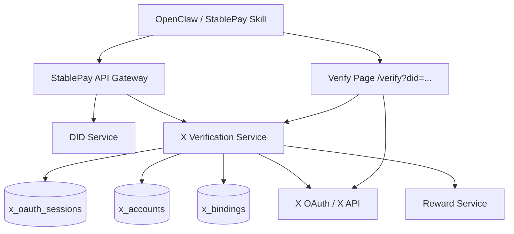
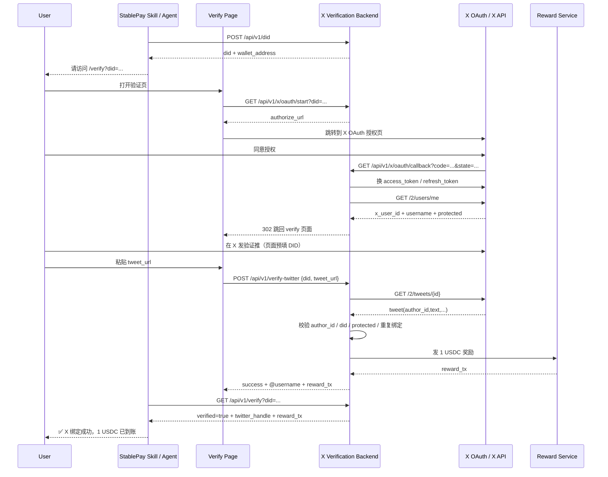

# StablePay X 验证最小真实链路

## 1. 这条链路到底要解决什么问题

StablePay 的 X 验证不是支付主链路本身，而是**注册防刷 + DID 绑定 + 注册奖励发放**。

按 PRD，目标是：

- 用户先创建 DID / 钱包
- 跳转到 `https://stablepay.co/verify?did=...`
- 发布一条包含 DID 的验证推文
- 粘贴推文链接
- 后端校验这条推文确实来自当前待绑定的 X 账号
- 绑定 DID ↔ X 账号
- 发放 1 USDC 注册奖励

所以最小真实版本的核心并不是“自动代用户发推”，而是：

> 先识别当前用户是谁，再验证这条推文是不是这个人本人发的、内容里有没有对应 DID。

---

## 2. 不要把目标做歪：最小真实版本不需要 `tweet.write`

### 你们真正需要的能力

对于 StablePay MVP，真正必须的能力是：

- `users.read`
  - 识别 OAuth 登录后的当前 X 用户是谁
  - 拿到 `x_user_id`、`username`、`protected`
- `tweet.read`
  - 根据用户粘贴的 tweet URL 读取对应推文
  - 校验 `author_id`、`text`、`created_at`
- `offline.access`（可选但推荐）
  - 让后端拿到 refresh token，避免 access token 过期后失效

### 你们当前不必须的能力

- `tweet.write`
  - 只有当你要“应用代表用户直接发推”时才需要
  - 你们 PRD 当前要的其实是“跳到 X 发帖页，预填内容，让用户自己确认发布”

这意味着：

**MVP 正确方向是：OAuth 识别用户 + 用户自己发验证推 + 用户贴链接回来 + 后端验证。**

而不是先做一个很重的“代发推平台”。

---

## 3. 最小真实链路的接口图



### 组件职责

- **OpenClaw / StablePay Skill**
  - 创建 DID
  - 告诉用户去验证页完成 X 绑定
  - 轮询验证结果，成功后在对话里通知

- **Verify Page**
  - 展示 “Connect X / Post Verification Tweet / Verify & Claim” 三步
  - 只是很薄的一层 UI，不负责业务真相

- **X Verification Service**
  - 生成 OAuth authorize URL
  - 处理 callback
  - 保存 OAuth 账号信息
  - 验证 tweet 与 DID 绑定关系
  - 写入 `x_bindings`
  - 调奖励服务发 1 USDC

- **X OAuth / X API**
  - OAuth 登录
  - `GET /2/users/me`
  - `GET /2/tweets/{id}`

---

## 4. 时序图（最小真实版本）



---

## 5. 建议保留和新增的接口

### 已有并应保留

#### `POST /api/v1/verify-twitter`
用途：最终验证 tweet 并完成绑定。

请求：

```json
{
  "did": "did:solana:xxxxx",
  "tweet_url": "https://x.com/username/status/123456789"
}
```

成功响应：

```json
{
  "success": true,
  "twitter_handle": "@alice",
  "reward_tx": "solana_tx_hash_or_mock_tx",
  "message": "Verification successful, 1 USDC sent"
}
```

#### `GET /api/v1/verify?did=...`
用途：给 Skill 或前端查询当前 DID 是否已验证。

---

### 新增（最小真实版本）

#### `GET /api/v1/x/oauth/start?did=...`
职责：

- 校验 DID 存在
- 生成 `state`
- 生成 `code_verifier`
- 计算 `code_challenge`
- 保存 oauth session
- 返回 authorize URL

返回：

```json
{
  "authorize_url": "https://x.com/i/oauth2/authorize?...",
  "state": "random-state",
  "expires_in": 300
}
```

#### `GET /api/v1/x/oauth/callback`
职责：

- 校验 `state`
- 用 `code + code_verifier` 换 token
- 调 `GET /2/users/me`
- 保存当前 OAuth 用户信息
- 跳回前端 verify 页面

#### `GET /api/v1/x/oauth/status?did=...`
职责：

- 告诉前端这个 DID 是否已经完成 X 连接
- 返回 `username`、`x_user_id`、`protected`、`token_expired`

---

## 6. `verify-twitter` 的真实校验逻辑

服务端不要再依赖 mock tweet store，而应该这样做：

### 入参

- `did`
- `tweet_url`

### 处理步骤

1. 校验 DID 存在
2. 校验该 DID 已完成 OAuth 连接
3. 从 `tweet_url` 里解析出 `tweet_id`
4. 使用当前 DID 对应的 OAuth access token 调 `GET /2/tweets/{id}`
5. 校验：
   - tweet 存在
   - tweet 的 `author_id == 当前 OAuth 登录用户的 x_user_id`
   - tweet 文本包含当前 `did`
   - tweet 文本包含最小模板前缀，例如：`I'm verifying my StablePay DID:`
   - 作者账号不是 `protected`
   - 当前 DID 还没绑定别的 X 账号
   - 当前 X 账号还没绑定别的 DID
6. 通过后：
   - 写入 `x_bindings`
   - 调用 reward service 发 1 USDC
   - 返回成功结果

### 推荐错误码

- `x_oauth_not_connected`
- `invalid_tweet_url`
- `tweet_not_found`
- `tweet_author_mismatch`
- `did_not_in_tweet`
- `twitter_account_protected`
- `did_already_bound`
- `twitter_already_bound`
- `reward_failed`

---

## 7. 建议的数据表

### 7.1 `x_oauth_sessions`
用于 PKCE 流程中的短期状态保存。

字段建议：

- `id`
- `did`
- `state`
- `code_verifier`
- `redirect_uri`
- `status` (`pending/authorized/expired`)
- `created_at`
- `expires_at`

### 7.2 `x_accounts`
用于保存 X OAuth 登录后的用户信息。

字段建议：

- `x_user_id` (unique)
- `username`
- `name`
- `protected`
- `access_token`（加密）
- `refresh_token`（加密，可空）
- `token_expires_at`
- `scope`
- `created_at`
- `updated_at`

### 7.3 `x_bindings`
用于最终绑定 DID ↔ X。

字段建议：

- `did` (unique)
- `x_user_id` (unique)
- `username`
- `tweet_id`
- `tweet_url`
- `reward_tx`
- `verified_at`
- `created_at`

### 唯一性原则

- 一个 DID 只能绑定一个 X
- 一个 X 只能绑定一个 DID
- 唯一主键不要只用 `username`
- 必须以 `x_user_id` 为准

---

## 8. 你的仓库现在应该怎么改

## 8.1 先承认当前状态

当前仓库主分支还是 **mock 后端仓库**：

- README 以 mock 为主
- 提供 curl 接口用于手工联调
- 没有实际 verify 页面代码
- 没有 React / Vite / Next.js 前端目录

所以它目前更像：

> 一个后端 API demo + curl/CLI 联调仓库

而不是完整产品形态。

---

## 8.2 最小改造路线

### 第一步：把 mock 后端升级成“真实 OAuth 后端”

保留：

- `POST /api/v1/verify-twitter`
- `GET /api/v1/verify`

新增：

- `GET /api/v1/x/oauth/start`
- `GET /api/v1/x/oauth/callback`
- `GET /api/v1/x/oauth/status`

新增内部模块：

- `internal/xclient`
- `internal/pkce`
- `internal/repository/xoauth`
- `internal/repository/xbindings`

---

### 第二步：给它补一个非常薄的 verify 页面

你不一定非要单独搞一整个 React 大前端。

有三种可选方案：

#### 方案 A：最小静态 HTML 页（最快）
适合现在。

你可以直接在同一个 Hertz 服务里挂一个静态页面：

- `GET /verify?did=...`
- 页面按钮：
  - Connect X
  - Post Verification Tweet
  - Verify & Claim

优点：

- 本地联调最简单
- 不需要额外前端项目
- 对你现在阶段最合适

#### 方案 B：单独 React 小前端（更像产品）
适合你后面要做官网或正式验证页。

前端只做三件事：

- 调 `/x/oauth/start`
- 处理 callback 回跳后的页面状态
- 调 `/verify-twitter`

#### 方案 C：纯 CLI / curl 联调（仅开发测试）
这个可以保留，但不能作为最终用户产品形态。

因为 OAuth 2.0 Authorization Code + PKCE 本质上就是浏览器跳转式流程，
它天然更适合页面，而不是纯命令行。

---

## 8.3 我建议你的落地选择

### 现在

- 后端：继续用 Hertz
- 前端：先补一个最小静态 verify 页面
- 联调：curl 仍然保留

### 以后

- 再把 verify 页面抽成 React
- 再接正式 `stablepay.co/verify`

这会比“现在就上独立前后端工程”更稳。

---

## 9. 本地开发需要的 env

```env
X_CLIENT_ID=your_client_id
X_CLIENT_SECRET=your_client_secret
X_REDIRECT_URI=http://localhost:8080/api/v1/x/oauth/callback
X_OAUTH_SCOPES=tweet.read users.read offline.access
X_AUTHORIZE_URL=https://x.com/i/oauth2/authorize
X_TOKEN_URL=https://api.x.com/2/oauth2/token
X_API_BASE_URL=https://api.x.com/2
X_VERIFY_TWEET_TEMPLATE=I'm verifying my StablePay DID: {DID}
FRONTEND_VERIFY_URL=http://127.0.0.1:3000/verify
ENCRYPTION_KEY=your_32_byte_base64_key
```

### 说明

- `X_CLIENT_ID` / `X_CLIENT_SECRET`：OAuth 用
- `X_REDIRECT_URI`：必须与 X Developer Console 完全一致
- `offline.access`：要 refresh token 才加
- `FRONTEND_VERIFY_URL`：OAuth 成功后回跳的页面地址
- `ENCRYPTION_KEY`：用于加密 access token / refresh token

---

## 10. 最终建议（一句话版本）

**StablePay 的 X 验证最小真实链路，不该做成“应用代发推平台”，而该做成“OAuth 识别用户 + 用户自己发验证推 + 粘贴 tweet URL + 后端验证绑定”的薄前端 + 真后端方案。**

也就是说：

- **要真实 OAuth**
- **不要先做 `tweet.write`**
- **要有一个很薄的 verify 页面**
- **仓库当前的 curl/CLI 只是开发联调方式，不是最终产品交互形态**

